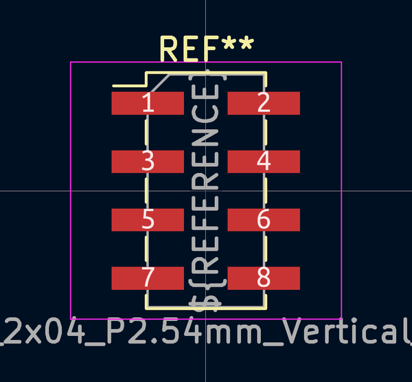
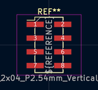
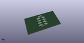

# OOMP Footprint  
##   by 4ms  
  
oomp key: oomp_4ms_4ms_connector_pins_2x04_p2_54mm_vertical_smd  
  
source repo at: [http://github.com/4ms/4ms-kicad-lib/blob/master/footprints-legacy/4ms-legacy-footprints.pretty/wire-hole.kicad_mod](http://github.com/4ms/4ms-kicad-lib/blob/master/footprints-legacy/4ms-legacy-footprints.pretty/wire-hole.kicad_mod)  
## Footprint  
  
  
  
  
| name | value | 
| --- | --- | 
| footprint name |  | 
| footprint description |  | 
| number of pads |  | 
| github path | http://github.com/4ms/4ms-kicad-lib/blob/master/footprints/4ms_Connector.pretty/Pins_2x04_P2.54mm_Vertical_SMD.kicad_mod | 
| oomp key | oomp_4ms_4ms_connector_pins_2x04_p2_54mm_vertical_smd | 
| oomp bot github | https://github.com/oomlout/oomlout_oomp_footprint_bot/tree/main/footprints/4ms_4ms_connector_pins_2x04_p2_54mm_vertical_smd/working | 
## Images  
  
  
  
  
  
  
  
  
