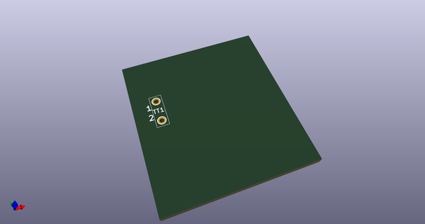
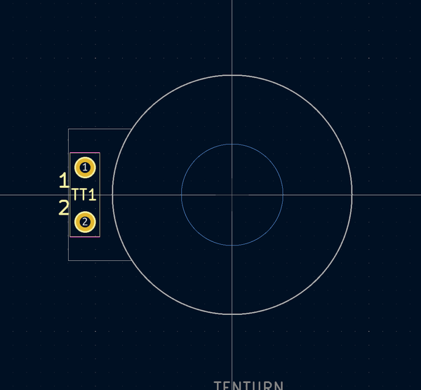

# OOMP Footprint  
## Pot_10Turn_3590S-2-202L  by 4ms  
  
oomp key: oomp_4ms_4ms_faceplate_pot_10turn_3590s_2_202l  
  
source repo at: [http://github.com/4ms/4ms-kicad-lib/blob/master/footprints-legacy/4ms-legacy-footprints.pretty/wire-hole.kicad_mod](http://github.com/4ms/4ms-kicad-lib/blob/master/footprints-legacy/4ms-legacy-footprints.pretty/wire-hole.kicad_mod)  
## Footprint  
  
  
  
  
| name | value | 
| --- | --- | 
| footprint name | Pot_10Turn_3590S-2-202L | 
| footprint description | module 1 pin (ou trou mecanique de percage) | 
| number of pads | 2 | 
| github path | http://github.com/4ms/4ms-kicad-lib/blob/master/footprints/4ms_Faceplate.pretty/Pot_10Turn_3590S-2-202L.kicad_mod | 
| oomp key | oomp_4ms_4ms_faceplate_pot_10turn_3590s_2_202l | 
| oomp bot github | https://github.com/oomlout/oomlout_oomp_footprint_bot/tree/main/footprints/4ms_4ms_faceplate_pot_10turn_3590s_2_202l/working | 
## Images  
