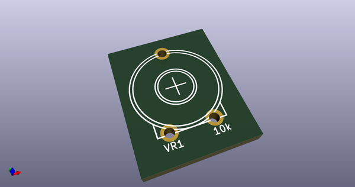
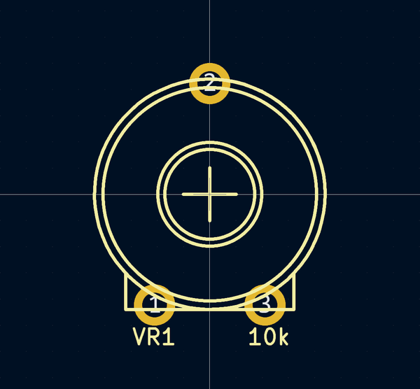

# OOMP Footprint  
## Trim_Round_Black_Large  by 4ms  
  
oomp key: oomp_4ms_4ms_legacy_footprints_trim_round_black_large  
  
source repo at: [http://github.com/4ms/4ms-kicad-lib/blob/master/footprints-legacy/4ms-legacy-footprints.pretty/wire-hole.kicad_mod](http://github.com/4ms/4ms-kicad-lib/blob/master/footprints-legacy/4ms-legacy-footprints.pretty/wire-hole.kicad_mod)  
## Footprint  
  
  
  
  
| name | value | 
| --- | --- | 
| footprint name | Trim_Round_Black_Large | 
| footprint description | None | 
| number of pads | 3 | 
| github path | http://github.com/4ms/4ms-kicad-lib/blob/master/footprints-legacy/4ms-legacy-footprints.pretty/Trim_Round_Black_Large.kicad_mod | 
| oomp key | oomp_4ms_4ms_legacy_footprints_trim_round_black_large | 
| oomp bot github | https://github.com/oomlout/oomlout_oomp_footprint_bot/tree/main/footprints/4ms_4ms_legacy_footprints_trim_round_black_large/working | 
## Images  
