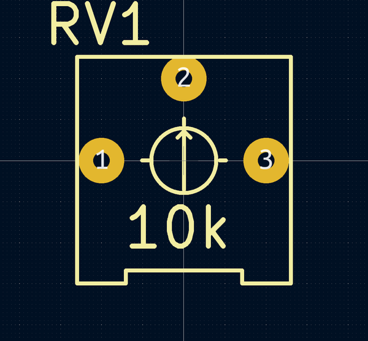

# OOMP Footprint  
## TRIM-T73YE  by 4ms  
  
oomp key: oomp_4ms_4ms_legacy_footprints_trim_t73ye  
  
source repo at: [http://github.com/4ms/4ms-kicad-lib/blob/master/footprints-legacy/4ms-legacy-footprints.pretty/wire-hole.kicad_mod](http://github.com/4ms/4ms-kicad-lib/blob/master/footprints-legacy/4ms-legacy-footprints.pretty/wire-hole.kicad_mod)  
## Footprint  
  
  
  
  
| name | value | 
| --- | --- | 
| footprint name | TRIM-T73YE | 
| footprint description | None | 
| number of pads | 3 | 
| github path | http://github.com/4ms/4ms-kicad-lib/blob/master/footprints-legacy/4ms-legacy-footprints.pretty/TRIM-T73YE.kicad_mod | 
| oomp key | oomp_4ms_4ms_legacy_footprints_trim_t73ye | 
| oomp bot github | https://github.com/oomlout/oomlout_oomp_footprint_bot/tree/main/footprints/4ms_4ms_legacy_footprints_trim_t73ye/working | 
## Images  
