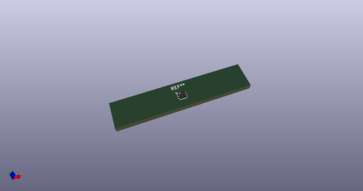
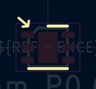
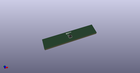

# OOMP Footprint  
##   by 4ms  
  
oomp key: oomp_4ms_4ms_package_qfp_dfn_6_1ep_2x2mm_p0_65mm_ep1x1_6mm  
  
source repo at: [http://github.com/4ms/4ms-kicad-lib/blob/master/footprints-legacy/4ms-legacy-footprints.pretty/wire-hole.kicad_mod](http://github.com/4ms/4ms-kicad-lib/blob/master/footprints-legacy/4ms-legacy-footprints.pretty/wire-hole.kicad_mod)  
## Footprint  
  
  
  
  
| name | value | 
| --- | --- | 
| footprint name |  | 
| footprint description |  | 
| number of pads |  | 
| github path | http://github.com/4ms/4ms-kicad-lib/blob/master/footprints/4ms_Package_QFP.pretty/DFN-6-1EP_2x2mm_P0.65mm_EP1x1.6mm.kicad_mod | 
| oomp key | oomp_4ms_4ms_package_qfp_dfn_6_1ep_2x2mm_p0_65mm_ep1x1_6mm | 
| oomp bot github | https://github.com/oomlout/oomlout_oomp_footprint_bot/tree/main/footprints/4ms_4ms_package_qfp_dfn_6_1ep_2x2mm_p0_65mm_ep1x1_6mm/working | 
## Images  
  
  
  
  
  
  
  
  
