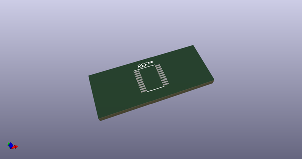
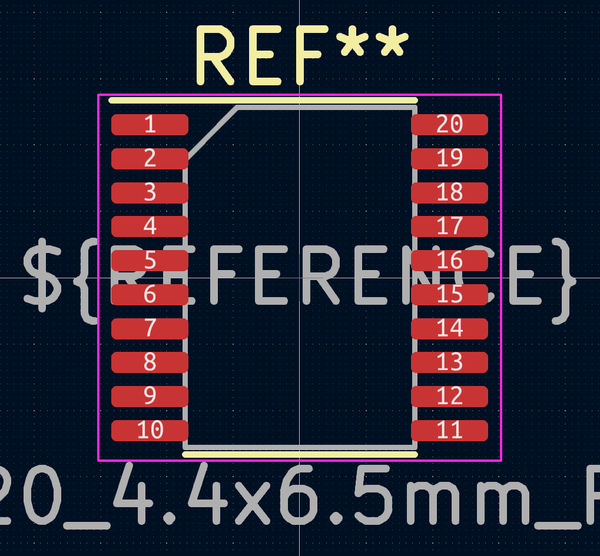

# OOMP Footprint  
##   by 4ms  
  
oomp key: oomp_4ms_4ms_package_ssop_tssop_20_4_4x6_5mm_p0_65mm  
  
source repo at: [http://github.com/4ms/4ms-kicad-lib/blob/master/footprints-legacy/4ms-legacy-footprints.pretty/wire-hole.kicad_mod](http://github.com/4ms/4ms-kicad-lib/blob/master/footprints-legacy/4ms-legacy-footprints.pretty/wire-hole.kicad_mod)  
## Footprint  
  
  
  
  
| name | value | 
| --- | --- | 
| footprint name |  | 
| footprint description |  | 
| number of pads |  | 
| github path | http://github.com/4ms/4ms-kicad-lib/blob/master/footprints/4ms_Package_SSOP.pretty/TSSOP-20_4.4x6.5mm_P0.65mm.kicad_mod | 
| oomp key | oomp_4ms_4ms_package_ssop_tssop_20_4_4x6_5mm_p0_65mm | 
| oomp bot github | https://github.com/oomlout/oomlout_oomp_footprint_bot/tree/main/footprints/4ms_4ms_package_ssop_tssop_20_4_4x6_5mm_p0_65mm/working | 
## Images  
