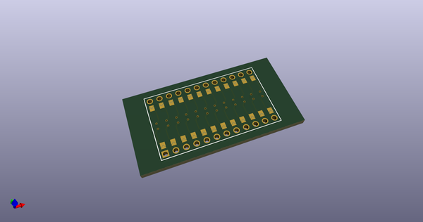
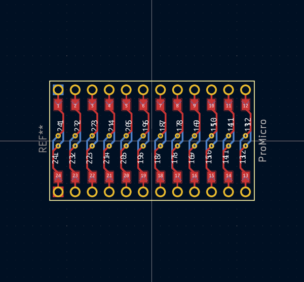

# OOMP Footprint  
## ProMicro  by 50an6xy06r6n  
  
oomp key: oomp_50an6xy06r6n_keyboard_reversible_promicro  
  
source repo at: [http://github.com/50an6xy06r6n/keyboard_reversible.pretty/blob/master/ProMicro_unrouted.kicad_mod](http://github.com/50an6xy06r6n/keyboard_reversible.pretty/blob/master/ProMicro_unrouted.kicad_mod)  
## Footprint  
  
  
  
  
| name | value | 
| --- | --- | 
| footprint name | ProMicro | 
| footprint description | Solder-jumper reversible Pro Micro footprint | 
| number of pads | 242 | 
| github path | http://github.com/50an6xy06r6n/keyboard_reversible.pretty/blob/master/ProMicro.kicad_mod | 
| oomp key | oomp_50an6xy06r6n_keyboard_reversible_promicro | 
| oomp bot github | https://github.com/oomlout/oomlout_oomp_footprint_bot/tree/main/footprints/50an6xy06r6n_keyboard_reversible_promicro/working | 
## Images  
