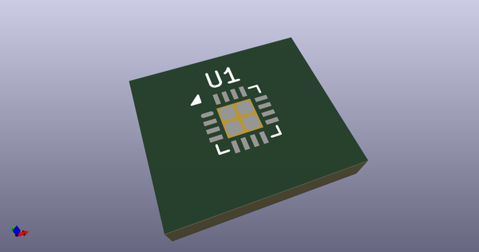
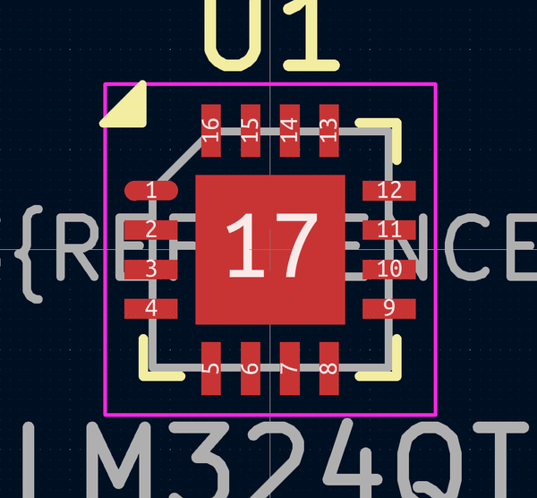

# OOMP Footprint  
## QFN-16-1EP_3x3mm_P0.5mm_EP1.9x1.9mm  by AcheronProject  
  
oomp key: oomp_acheronproject_acheron_components_qfn_16_1ep_3x3mm_p0_5mm_ep1_9x1_9mm  
  
source repo at: [http://github.com/AcheronProject/acheron_Components.pretty/blob/master/VQFN-16-1EP_3x3mm_P0.5mm_EP1.6x1.6mm.kicad_mod](http://github.com/AcheronProject/acheron_Components.pretty/blob/master/VQFN-16-1EP_3x3mm_P0.5mm_EP1.6x1.6mm.kicad_mod)  
## Footprint  
  
  
  
  
| name | value | 
| --- | --- | 
| footprint name | QFN-16-1EP_3x3mm_P0.5mm_EP1.9x1.9mm | 
| footprint description | QFN, 16 Pin (https://www.nxp.com/docs/en/package-information/98ASA00525D.pdf), generated with kicad-footprint-generator ipc_noLead_generator.py | 
| number of pads | 21 | 
| github path | http://github.com/AcheronProject/acheron_Components.pretty/blob/master/QFN-16-1EP_3x3mm_P0.5mm_EP1.9x1.9mm.kicad_mod | 
| oomp key | oomp_acheronproject_acheron_components_qfn_16_1ep_3x3mm_p0_5mm_ep1_9x1_9mm | 
| oomp bot github | https://github.com/oomlout/oomlout_oomp_footprint_bot/tree/main/footprints/acheronproject_acheron_components_qfn_16_1ep_3x3mm_p0_5mm_ep1_9x1_9mm/working | 
## Images  
