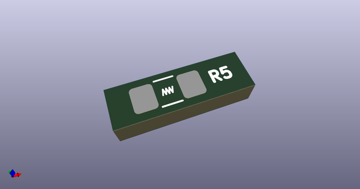

# OOMP Footprint  
## R_SMD_1206  by AcheronProject  
  
oomp key: oomp_acheronproject_acheron_components_r_smd_1206  
  
source repo at: [http://github.com/AcheronProject/acheron_Components.pretty/blob/master/VQFN-16-1EP_3x3mm_P0.5mm_EP1.6x1.6mm.kicad_mod](http://github.com/AcheronProject/acheron_Components.pretty/blob/master/VQFN-16-1EP_3x3mm_P0.5mm_EP1.6x1.6mm.kicad_mod)  
## Footprint  
  
  
  
  
| name | value | 
| --- | --- | 
| footprint name | R_SMD_1206 | 
| footprint description | Resistor SMD 1206 (3216 Metric), square (rectangular) end terminal, IPC_7351 nominal with elongated pad for handsoldering. (Body size source: http://www.tortai-tech.com/upload/download/2011102023233369053.pdf), generated with kicad-footprint-generator | 
| number of pads | 2 | 
| github path | http://github.com/AcheronProject/acheron_Components.pretty/blob/master/R_SMD_1206.kicad_mod | 
| oomp key | oomp_acheronproject_acheron_components_r_smd_1206 | 
| oomp bot github | https://github.com/oomlout/oomlout_oomp_footprint_bot/tree/main/footprints/acheronproject_acheron_components_r_smd_1206/working | 
## Images  
