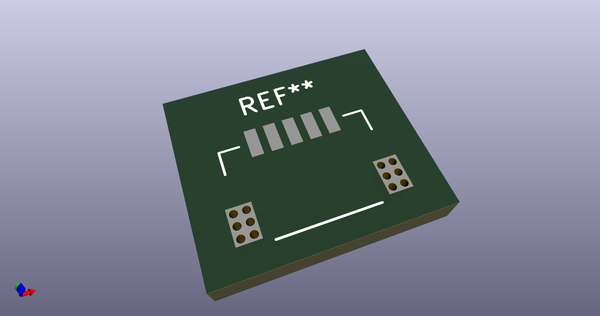
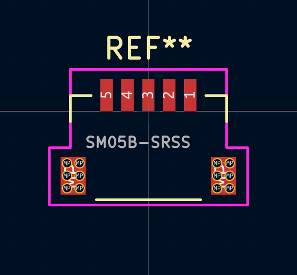

# OOMP Footprint  
##   by AcheronProject  
  
oomp key: oomp_acheronproject_acheron_connectors_sm05b_srss_mountingpin  
  
source repo at: [http://github.com/AcheronProject/acheron_Connectors.pretty/blob/master/XFCN_F1004-H-16-20G-R_P1.0mm_MountingReliefs.kicad_mod](http://github.com/AcheronProject/acheron_Connectors.pretty/blob/master/XFCN_F1004-H-16-20G-R_P1.0mm_MountingReliefs.kicad_mod)  
## Footprint  
  
  
  
  
| name | value | 
| --- | --- | 
| footprint name |  | 
| footprint description |  | 
| number of pads |  | 
| github path | http://github.com/AcheronProject/acheron_Connectors.pretty/blob/master/SM05B-SRSS_MountingPin.kicad_mod | 
| oomp key | oomp_acheronproject_acheron_connectors_sm05b_srss_mountingpin | 
| oomp bot github | https://github.com/oomlout/oomlout_oomp_footprint_bot/tree/main/footprints/acheronproject_acheron_connectors_sm05b_srss_mountingpin/working | 
## Images  
