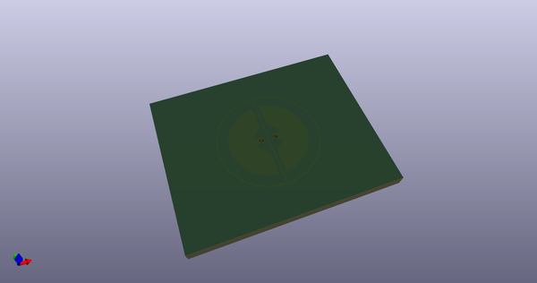
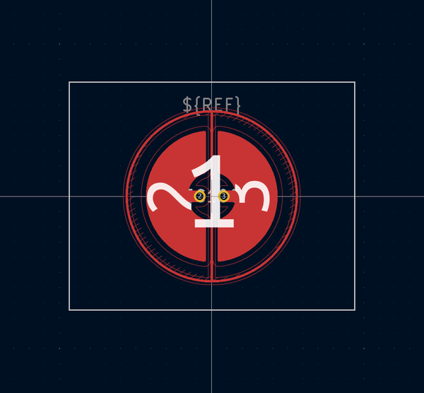

# OOMP Footprint  
## EC125  by AcheronProject  
  
oomp key: oomp_acheronproject_acheron_ec_ec125  
  
source repo at: [http://github.com/AcheronProject/acheron_EC.pretty/blob/master/EC625.kicad_mod](http://github.com/AcheronProject/acheron_EC.pretty/blob/master/EC625.kicad_mod)  
## Footprint  
  
  
  
  
| name | value | 
| --- | --- | 
| footprint name | EC125 | 
| footprint description | None | 
| number of pads | 7 | 
| github path | http://github.com/AcheronProject/acheron_EC.pretty/blob/master/EC125.kicad_mod | 
| oomp key | oomp_acheronproject_acheron_ec_ec125 | 
| oomp bot github | https://github.com/oomlout/oomlout_oomp_footprint_bot/tree/main/footprints/acheronproject_acheron_ec_ec125/working | 
## Images  
