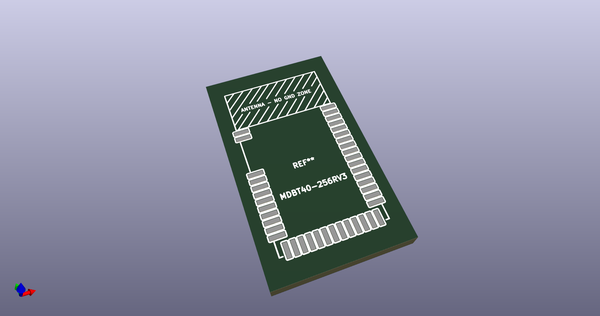
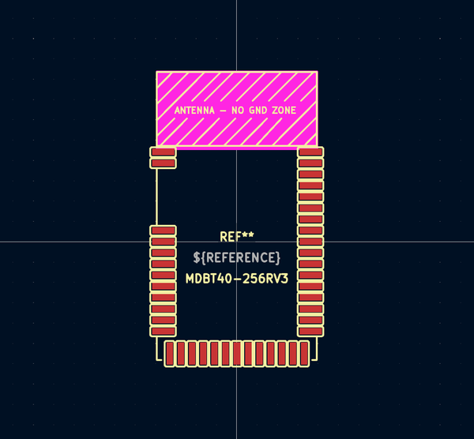

# OOMP Footprint  
## MDBT40-256RV3  by AcheronProject  
  
oomp key: oomp_acheronproject_acheron_hardware_mdbt40_256rv3  
  
source repo at: [http://github.com/AcheronProject/acheron_Hardware.pretty/blob/master/RKJXT1F.kicad_mod](http://github.com/AcheronProject/acheron_Hardware.pretty/blob/master/RKJXT1F.kicad_mod)  
## Footprint  
  
  
  
  
| name | value | 
| --- | --- | 
| footprint name | MDBT40-256RV3 | 
| footprint description | 8-Lead Plastic Small Outline (SN) - Narrow, 3.90 mm Body [SOIC] (see Microchip Packaging Specification 00000049BS.pdf) | 
| number of pads | 42 | 
| github path | http://github.com/AcheronProject/acheron_Hardware.pretty/blob/master/MDBT40-256RV3.kicad_mod | 
| oomp key | oomp_acheronproject_acheron_hardware_mdbt40_256rv3 | 
| oomp bot github | https://github.com/oomlout/oomlout_oomp_footprint_bot/tree/main/footprints/acheronproject_acheron_hardware_mdbt40_256rv3/working | 
## Images  
