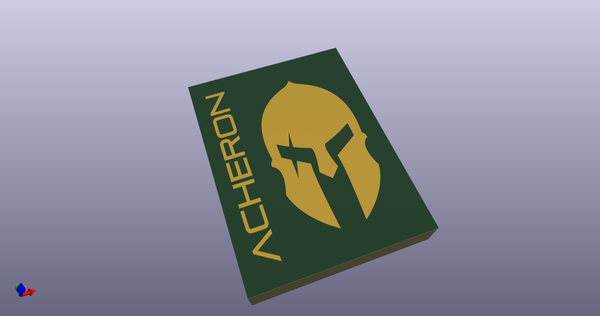
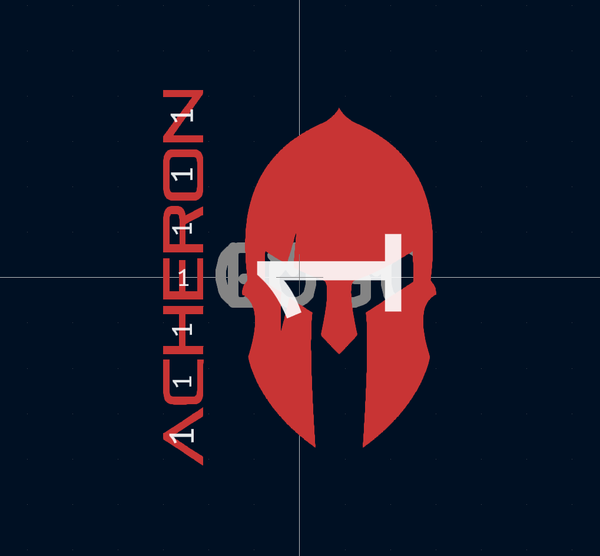

# OOMP Footprint  
## acheronShort_0.3x0.5in_Plated  by AcheronProject  
  
oomp key: oomp_acheronproject_acheron_logos_acheronshort_0_3x0_5in_plated  
  
source repo at: [http://github.com/AcheronProject/acheron_Logos.pretty/blob/master/acheronShort_15.2x21mm_Plated.kicad_mod](http://github.com/AcheronProject/acheron_Logos.pretty/blob/master/acheronShort_15.2x21mm_Plated.kicad_mod)  
## Footprint  
  
  
  
  
| name | value | 
| --- | --- | 
| footprint name | acheronShort_0.3x0.5in_Plated | 
| footprint description | None | 
| number of pads | 8 | 
| github path | http://github.com/AcheronProject/acheron_Logos.pretty/blob/master/acheronShort_0.3x0.5in_Plated.kicad_mod | 
| oomp key | oomp_acheronproject_acheron_logos_acheronshort_0_3x0_5in_plated | 
| oomp bot github | https://github.com/oomlout/oomlout_oomp_footprint_bot/tree/main/footprints/acheronproject_acheron_logos_acheronshort_0_3x0_5in_plated/working | 
## Images  
