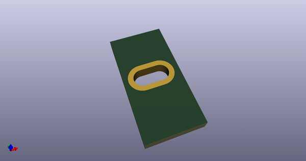

# OOMP Footprint  
## MoutingHole_Oval_7mm_5.0x2.5mm  by AcheronProject  
  
oomp key: oomp_acheronproject_acheron_mountingholes_moutinghole_oval_7mm_5_0x2_5mm  
  
source repo at: [http://github.com/AcheronProject/acheron_MountingHoles.pretty/blob/master/ToolingHole_1.152mm_(for_JLCPCB_SMT).kicad_mod](http://github.com/AcheronProject/acheron_MountingHoles.pretty/blob/master/ToolingHole_1.152mm_(for_JLCPCB_SMT).kicad_mod)  
## Footprint  
  
  
  
  
| name | value | 
| --- | --- | 
| footprint name | MoutingHole_Oval_7mm_5.0x2.5mm | 
| footprint description | None | 
| number of pads | 1 | 
| github path | http://github.com/AcheronProject/acheron_MountingHoles.pretty/blob/master/MoutingHole_Oval_7mm_5.0x2.5mm.kicad_mod | 
| oomp key | oomp_acheronproject_acheron_mountingholes_moutinghole_oval_7mm_5_0x2_5mm | 
| oomp bot github | https://github.com/oomlout/oomlout_oomp_footprint_bot/tree/main/footprints/acheronproject_acheron_mountingholes_moutinghole_oval_7mm_5_0x2_5mm/working | 
## Images  
