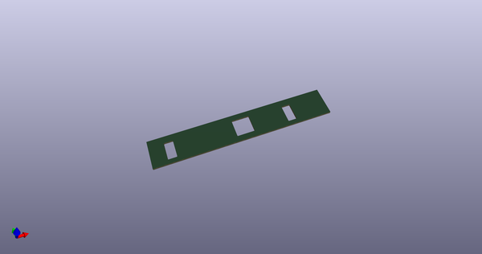
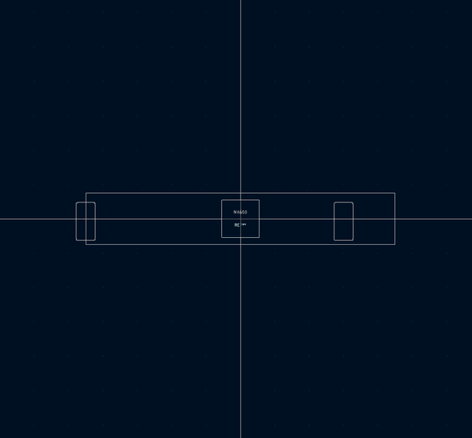

# OOMP Footprint  
## MX600  by AcheronProject  
  
oomp key: oomp_acheronproject_acheron_mx_plateslots_mx600  
  
source repo at: [http://github.com/AcheronProject/acheron_MX_PlateSlots.pretty/blob/master/MX_ISO_Enter.kicad_mod](http://github.com/AcheronProject/acheron_MX_PlateSlots.pretty/blob/master/MX_ISO_Enter.kicad_mod)  
## Footprint  
  
  
  
  
| name | value | 
| --- | --- | 
| footprint name | MX600 | 
| footprint description | None | 
| number of pads | 0 | 
| github path | http://github.com/AcheronProject/acheron_MX_PlateSlots.pretty/blob/master/MX600.kicad_mod | 
| oomp key | oomp_acheronproject_acheron_mx_plateslots_mx600 | 
| oomp bot github | https://github.com/oomlout/oomlout_oomp_footprint_bot/tree/main/footprints/acheronproject_acheron_mx_plateslots_mx600/working | 
## Images  
