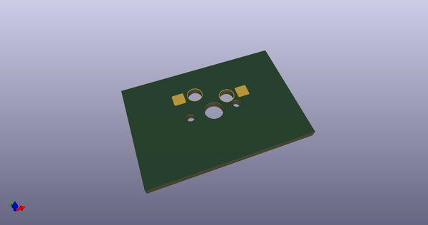
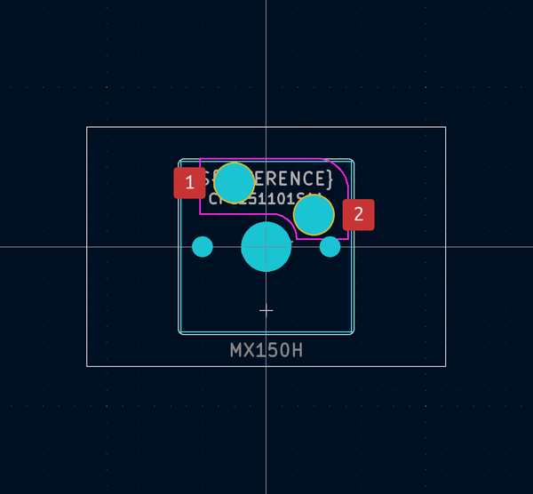

# OOMP Footprint  
## MX150H  by AcheronProject  
  
oomp key: oomp_acheronproject_acheron_mxh_metalrings_mx150h  
  
source repo at: [http://github.com/AcheronProject/acheron_MXH_metalrings.pretty/blob/master/MX_ISOEnterH.kicad_mod](http://github.com/AcheronProject/acheron_MXH_metalrings.pretty/blob/master/MX_ISOEnterH.kicad_mod)  
## Footprint  
  
  
  
  
| name | value | 
| --- | --- | 
| footprint name | MX150H | 
| footprint description | None | 
| number of pads | 7 | 
| github path | http://github.com/AcheronProject/acheron_MXH_metalrings.pretty/blob/master/MX150H.kicad_mod | 
| oomp key | oomp_acheronproject_acheron_mxh_metalrings_mx150h | 
| oomp bot github | https://github.com/oomlout/oomlout_oomp_footprint_bot/tree/main/footprints/acheronproject_acheron_mxh_metalrings_mx150h/working | 
## Images  
