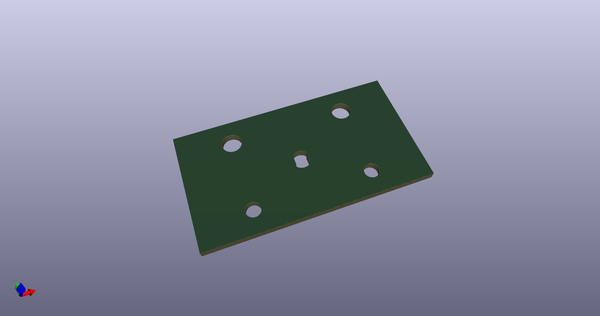
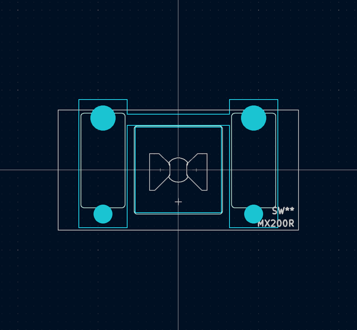

# OOMP Footprint  
## MXO200R  by AcheronProject  
  
oomp key: oomp_acheronproject_acheron_mxo_mxo200r  
  
source repo at: [http://github.com/AcheronProject/acheron_MXO.pretty/blob/master/MXO_ISOEnter_Horizontal_Reversed.kicad_mod](http://github.com/AcheronProject/acheron_MXO.pretty/blob/master/MXO_ISOEnter_Horizontal_Reversed.kicad_mod)  
## Footprint  
  
  
  
  
| name | value | 
| --- | --- | 
| footprint name | MXO200R | 
| footprint description | None | 
| number of pads | 4 | 
| github path | http://github.com/AcheronProject/acheron_MXO.pretty/blob/master/MXO200R.kicad_mod | 
| oomp key | oomp_acheronproject_acheron_mxo_mxo200r | 
| oomp bot github | https://github.com/oomlout/oomlout_oomp_footprint_bot/tree/main/footprints/acheronproject_acheron_mxo_mxo200r/working | 
## Images  
