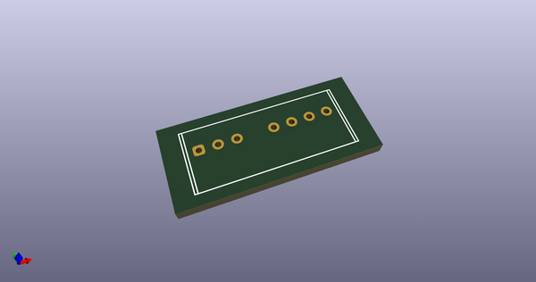
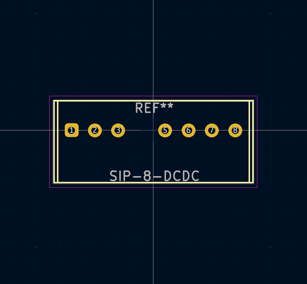

# OOMP Footprint  
## SIP-8-DCDC  by adamgreig  
  
oomp key: oomp_adamgreig_agg_sip_8_dcdc  
  
source repo at: [http://github.com/adamgreig/agg-kicad/blob/master/agg.pretty/unchecked.pretty/XTAL50x32.kicad_mod](http://github.com/adamgreig/agg-kicad/blob/master/agg.pretty/unchecked.pretty/XTAL50x32.kicad_mod)  
## Footprint  
  
  
  
  
| name | value | 
| --- | --- | 
| footprint name | SIP-8-DCDC | 
| footprint description | None | 
| number of pads | 7 | 
| github path | http://github.com/adamgreig/agg-kicad/blob/master/agg.pretty/SIP-8-DCDC.kicad_mod | 
| oomp key | oomp_adamgreig_agg_sip_8_dcdc | 
| oomp bot github | https://github.com/oomlout/oomlout_oomp_footprint_bot/tree/main/footprints/adamgreig_agg_sip_8_dcdc/working | 
## Images  
