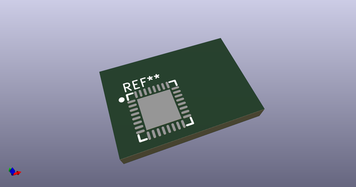
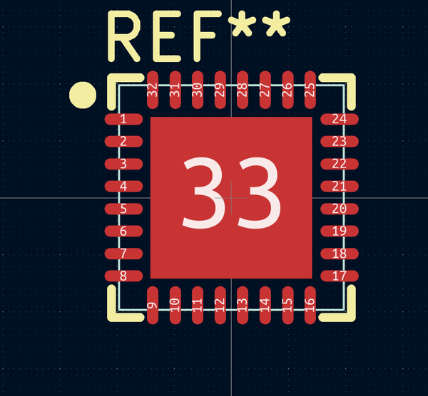

# OOMP Footprint  
## MKV10Z16VFM7  by adamjvr  
  
oomp key: oomp_adamjvr_onhand_components_mkv10z16vfm7  
  
source repo at: [http://github.com/adamjvr/KiCAD-OnHand-Lib/blob/master/OnHand-Components.pretty/VNH5019ATR-E.kicad_mod](http://github.com/adamjvr/KiCAD-OnHand-Lib/blob/master/OnHand-Components.pretty/VNH5019ATR-E.kicad_mod)  
## Footprint  
  
  
  
  
| name | value | 
| --- | --- | 
| footprint name | MKV10Z16VFM7 | 
| footprint description | None | 
| number of pads | 33 | 
| github path | http://github.com/adamjvr/KiCAD-OnHand-Lib/blob/master/OnHand-Components.pretty/MKV10Z16VFM7.kicad_mod | 
| oomp key | oomp_adamjvr_onhand_components_mkv10z16vfm7 | 
| oomp bot github | https://github.com/oomlout/oomlout_oomp_footprint_bot/tree/main/footprints/adamjvr_onhand_components_mkv10z16vfm7/working | 
## Images  
