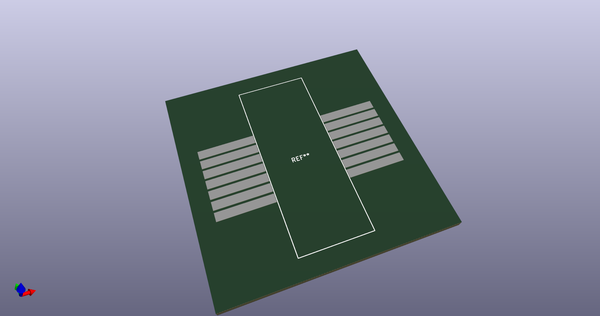
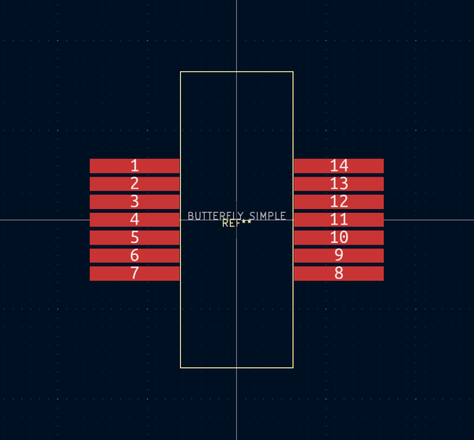

# OOMP Footprint  
## BUTTERFLY_SIMPLE  by aewallin  
  
oomp key: oomp_aewallin_awallinkicadfootprints_butterfly_simple  
  
source repo at: [http://github.com/aewallin/awallinKiCadFootprints.pretty/blob/master/Y3split_0.350mm.kicad_mod](http://github.com/aewallin/awallinKiCadFootprints.pretty/blob/master/Y3split_0.350mm.kicad_mod)  
## Footprint  
  
  
  
  
| name | value | 
| --- | --- | 
| footprint name | BUTTERFLY_SIMPLE | 
| footprint description | None | 
| number of pads | 14 | 
| github path | http://github.com/aewallin/awallinKiCadFootprints.pretty/blob/master/BUTTERFLY_SIMPLE.kicad_mod | 
| oomp key | oomp_aewallin_awallinkicadfootprints_butterfly_simple | 
| oomp bot github | https://github.com/oomlout/oomlout_oomp_footprint_bot/tree/main/footprints/aewallin_awallinkicadfootprints_butterfly_simple/working | 
## Images  
