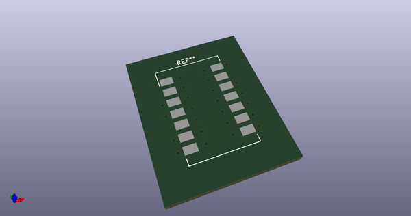
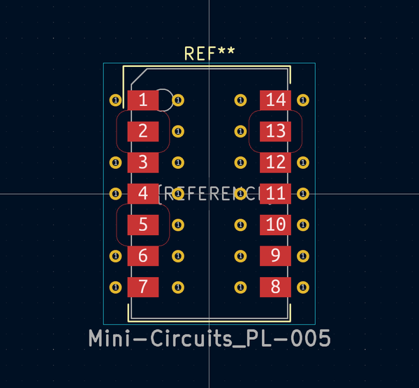

# OOMP Footprint  
## Mini-Circuits_PL-005  by aewallin  
  
oomp key: oomp_aewallin_awallinkicadfootprints_mini_circuits_pl_005  
  
source repo at: [http://github.com/aewallin/awallinKiCadFootprints.pretty/blob/master/Y3split_0.350mm.kicad_mod](http://github.com/aewallin/awallinKiCadFootprints.pretty/blob/master/Y3split_0.350mm.kicad_mod)  
## Footprint  
  
  
  
  
| name | value | 
| --- | --- | 
| footprint name | Mini-Circuits_PL-005 | 
| footprint description | https://ww2.minicircuits.com/pcb/98-pl005.pdf | 
| number of pads | 39 | 
| github path | http://github.com/aewallin/awallinKiCadFootprints.pretty/blob/master/Mini-Circuits_PL-005.kicad_mod | 
| oomp key | oomp_aewallin_awallinkicadfootprints_mini_circuits_pl_005 | 
| oomp bot github | https://github.com/oomlout/oomlout_oomp_footprint_bot/tree/main/footprints/aewallin_awallinkicadfootprints_mini_circuits_pl_005/working | 
## Images  
