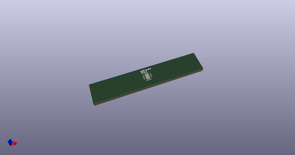

# OOMP Footprint  
## WSON-8-1EP_3x3mm_P0.5mm_EP1.45x2.4mm  by aewallin  
  
oomp key: oomp_aewallin_awallinkicadfootprints_wson_8_1ep_3x3mm_p0_5mm_ep1_45x2_4mm  
  
source repo at: [http://github.com/aewallin/awallinKiCadFootprints.pretty/blob/master/Y3split_0.350mm.kicad_mod](http://github.com/aewallin/awallinKiCadFootprints.pretty/blob/master/Y3split_0.350mm.kicad_mod)  
## Footprint  
  
  
  
  
| name | value | 
| --- | --- | 
| footprint name | WSON-8-1EP_3x3mm_P0.5mm_EP1.45x2.4mm | 
| footprint description | 8-Lead Plastic WSON, 3x3mm Body, 0.5mm Pitch, WSON-8, https://www.ti.com/lit/ds/symlink/ina333.pdf | 
| number of pads | 11 | 
| github path | http://github.com/aewallin/awallinKiCadFootprints.pretty/blob/master/WSON-8-1EP_3x3mm_P0.5mm_EP1.45x2.4mm.kicad_mod | 
| oomp key | oomp_aewallin_awallinkicadfootprints_wson_8_1ep_3x3mm_p0_5mm_ep1_45x2_4mm | 
| oomp bot github | https://github.com/oomlout/oomlout_oomp_footprint_bot/tree/main/footprints/aewallin_awallinkicadfootprints_wson_8_1ep_3x3mm_p0_5mm_ep1_45x2_4mm/working | 
## Images  
