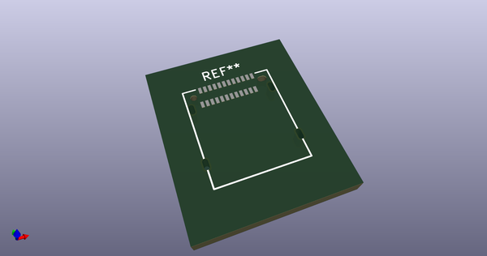
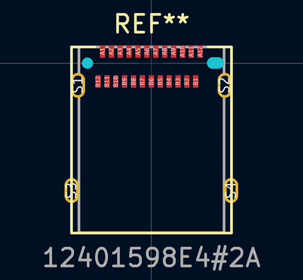

# OOMP Footprint  
## 12401598E4#2A  by ai03-2725  
  
oomp key: oomp_ai03_2725_type_c_12401598e4#2a  
  
source repo at: [http://github.com/ai03-2725/Type-C.pretty/blob/master/Wurth-632723300011.kicad_mod](http://github.com/ai03-2725/Type-C.pretty/blob/master/Wurth-632723300011.kicad_mod)  
## Footprint  
  
  
  
  
| name | value | 
| --- | --- | 
| footprint name | 12401598E4#2A | 
| footprint description | None | 
| number of pads | 30 | 
| github path | http://github.com/ai03-2725/Type-C.pretty/blob/master/12401598E4#2A.kicad_mod | 
| oomp key | oomp_ai03_2725_type_c_12401598e4#2a | 
| oomp bot github | https://github.com/oomlout/oomlout_oomp_footprint_bot/tree/main/footprints/ai03_2725_type_c_12401598e4#2a/working | 
## Images  
