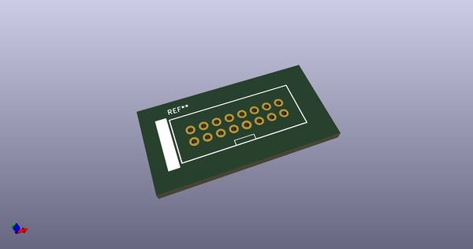
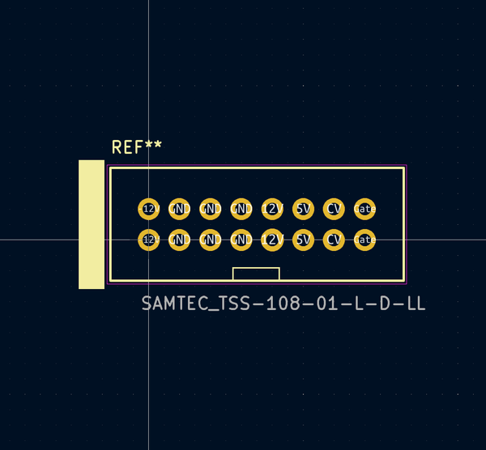

# OOMP Footprint  
## EurorackPower_2x8_Shrouded  by AkiyukiOkayasu  
  
oomp key: oomp_akiyukiokayasu_kicad_akiyuki_footprint_eurorackpower_2x8_shrouded  
  
source repo at: [http://github.com/AkiyukiOkayasu/Kicad_Akiyuki_Footprint.pretty/blob/master/USB_MicroB_PowerOnly.kicad_mod](http://github.com/AkiyukiOkayasu/Kicad_Akiyuki_Footprint.pretty/blob/master/USB_MicroB_PowerOnly.kicad_mod)  
## Footprint  
  
  
  
  
| name | value | 
| --- | --- | 
| footprint name | EurorackPower_2x8_Shrouded | 
| footprint description | None | 
| number of pads | 16 | 
| github path | http://github.com/AkiyukiOkayasu/Kicad_Akiyuki_Footprint.pretty/blob/master/EurorackPower_2x8_Shrouded.kicad_mod | 
| oomp key | oomp_akiyukiokayasu_kicad_akiyuki_footprint_eurorackpower_2x8_shrouded | 
| oomp bot github | https://github.com/oomlout/oomlout_oomp_footprint_bot/tree/main/footprints/akiyukiokayasu_kicad_akiyuki_footprint_eurorackpower_2x8_shrouded/working | 
## Images  
