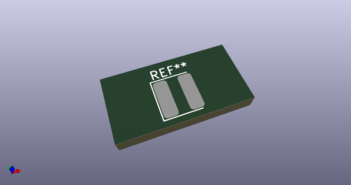
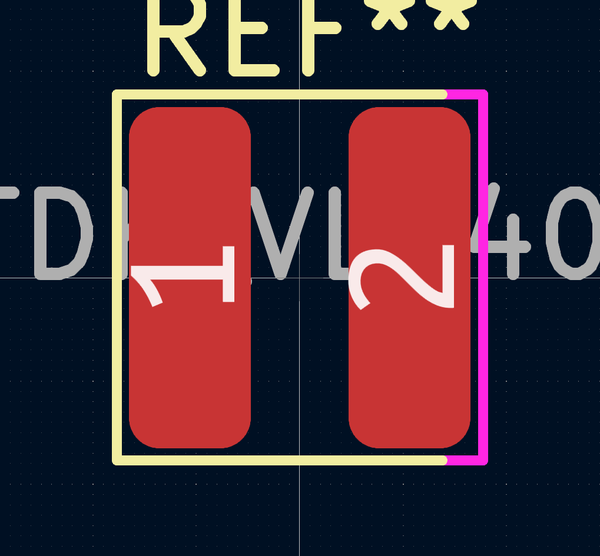

# OOMP Footprint  
## L_TDK_VLS4012  by AkiyukiOkayasu  
  
oomp key: oomp_akiyukiokayasu_kicad_akiyuki_footprint_l_tdk_vls4012  
  
source repo at: [http://github.com/AkiyukiOkayasu/Kicad_Akiyuki_Footprint.pretty/blob/master/USB_MicroB_PowerOnly.kicad_mod](http://github.com/AkiyukiOkayasu/Kicad_Akiyuki_Footprint.pretty/blob/master/USB_MicroB_PowerOnly.kicad_mod)  
## Footprint  
  
  
  
  
| name | value | 
| --- | --- | 
| footprint name | L_TDK_VLS4012 | 
| footprint description | Inductor | 
| number of pads | 2 | 
| github path | http://github.com/AkiyukiOkayasu/Kicad_Akiyuki_Footprint.pretty/blob/master/L_TDK_VLS4012.kicad_mod | 
| oomp key | oomp_akiyukiokayasu_kicad_akiyuki_footprint_l_tdk_vls4012 | 
| oomp bot github | https://github.com/oomlout/oomlout_oomp_footprint_bot/tree/main/footprints/akiyukiokayasu_kicad_akiyuki_footprint_l_tdk_vls4012/working | 
## Images  
