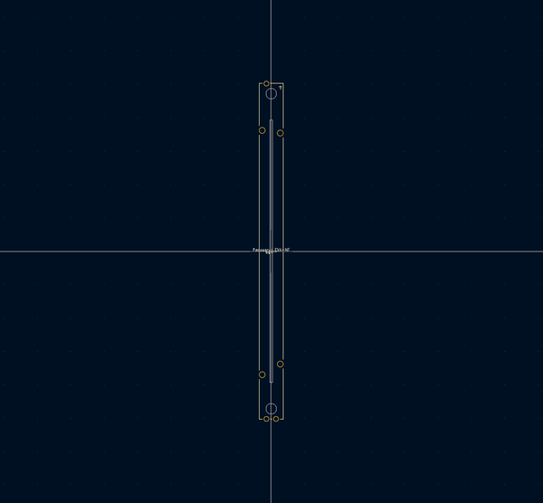

# OOMP Footprint  
## Panasonic_EVA-NF  by AkiyukiOkayasu  
  
oomp key: oomp_akiyukiokayasu_kicad_akiyuki_footprint_panasonic_eva_nf  
  
source repo at: [http://github.com/AkiyukiOkayasu/Kicad_Akiyuki_Footprint.pretty/blob/master/USB_MicroB_PowerOnly.kicad_mod](http://github.com/AkiyukiOkayasu/Kicad_Akiyuki_Footprint.pretty/blob/master/USB_MicroB_PowerOnly.kicad_mod)  
## Footprint  
  
  
  
  
| name | value | 
| --- | --- | 
| footprint name | Panasonic_EVA-NF | 
| footprint description | 100mm fader | 
| number of pads | 7 | 
| github path | http://github.com/AkiyukiOkayasu/Kicad_Akiyuki_Footprint.pretty/blob/master/Panasonic_EVA-NF.kicad_mod | 
| oomp key | oomp_akiyukiokayasu_kicad_akiyuki_footprint_panasonic_eva_nf | 
| oomp bot github | https://github.com/oomlout/oomlout_oomp_footprint_bot/tree/main/footprints/akiyukiokayasu_kicad_akiyuki_footprint_panasonic_eva_nf/working | 
## Images  
