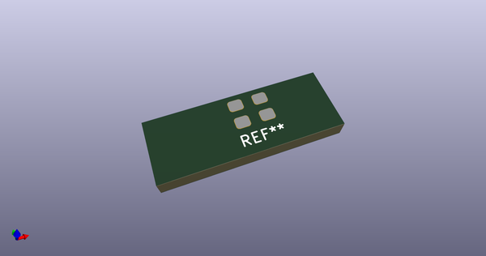

# OOMP Footprint  
## SeikoEpson_SG310  by AkiyukiOkayasu  
  
oomp key: oomp_akiyukiokayasu_kicad_akiyuki_footprint_seikoepson_sg310  
  
source repo at: [http://github.com/AkiyukiOkayasu/Kicad_Akiyuki_Footprint.pretty/blob/master/USB_MicroB_PowerOnly.kicad_mod](http://github.com/AkiyukiOkayasu/Kicad_Akiyuki_Footprint.pretty/blob/master/USB_MicroB_PowerOnly.kicad_mod)  
## Footprint  
  
  
  
  
| name | value | 
| --- | --- | 
| footprint name | SeikoEpson_SG310 | 
| footprint description | Crystal oscillator (SPXO) | 
| number of pads | 4 | 
| github path | http://github.com/AkiyukiOkayasu/Kicad_Akiyuki_Footprint.pretty/blob/master/SeikoEpson_SG310.kicad_mod | 
| oomp key | oomp_akiyukiokayasu_kicad_akiyuki_footprint_seikoepson_sg310 | 
| oomp bot github | https://github.com/oomlout/oomlout_oomp_footprint_bot/tree/main/footprints/akiyukiokayasu_kicad_akiyuki_footprint_seikoepson_sg310/working | 
## Images  
