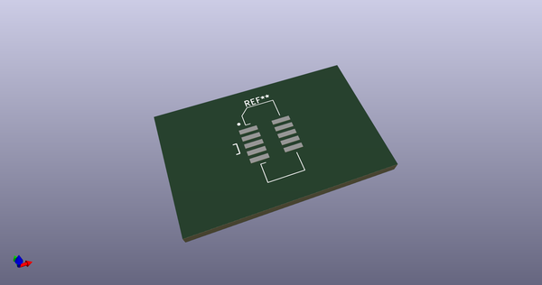
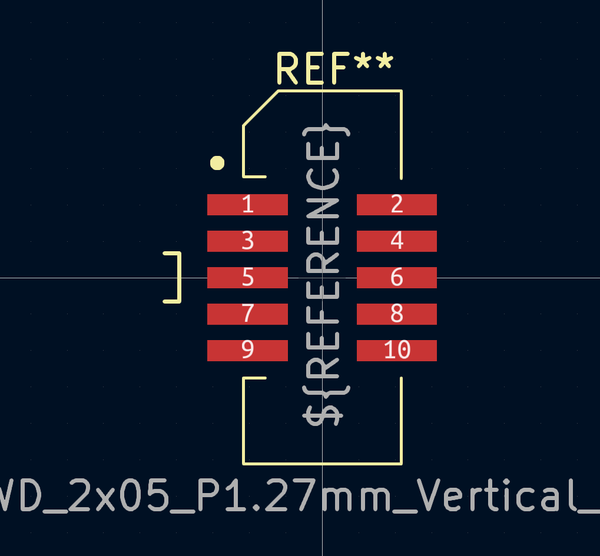

# OOMP Footprint  
## SWD_2x05_P1.27mm_Vertical_SMD  by AkiyukiOkayasu  
  
oomp key: oomp_akiyukiokayasu_kicad_akiyuki_footprint_swd_2x05_p1_27mm_vertical_smd  
  
source repo at: [http://github.com/AkiyukiOkayasu/Kicad_Akiyuki_Footprint.pretty/blob/master/USB_MicroB_PowerOnly.kicad_mod](http://github.com/AkiyukiOkayasu/Kicad_Akiyuki_Footprint.pretty/blob/master/USB_MicroB_PowerOnly.kicad_mod)  
## Footprint  
  
  
  
  
| name | value | 
| --- | --- | 
| footprint name | SWD_2x05_P1.27mm_Vertical_SMD | 
| footprint description | surface-mounted straight pin header, 2x05, 1.27mm pitch, double rows | 
| number of pads | 10 | 
| github path | http://github.com/AkiyukiOkayasu/Kicad_Akiyuki_Footprint.pretty/blob/master/SWD_2x05_P1.27mm_Vertical_SMD.kicad_mod | 
| oomp key | oomp_akiyukiokayasu_kicad_akiyuki_footprint_swd_2x05_p1_27mm_vertical_smd | 
| oomp bot github | https://github.com/oomlout/oomlout_oomp_footprint_bot/tree/main/footprints/akiyukiokayasu_kicad_akiyuki_footprint_swd_2x05_p1_27mm_vertical_smd/working | 
## Images  
