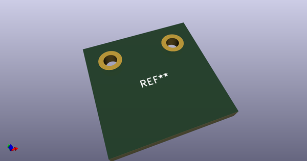
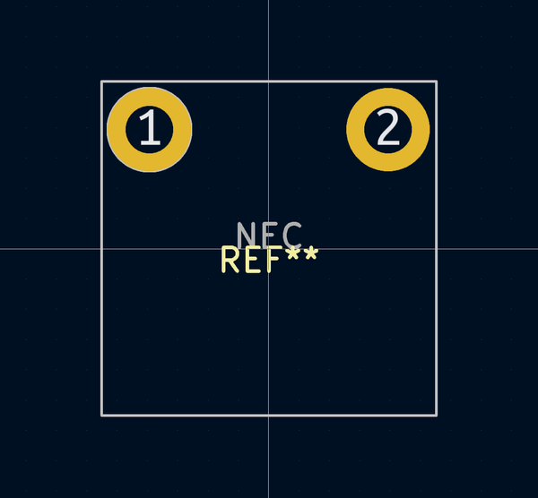

# OOMP Footprint  
## NEC  by Alasofia  
  
oomp key: oomp_alasofia_nec_nec  
  
source repo at: [http://github.com/Alasofia/nec.pretty/blob/master/nec.kicad_mod](http://github.com/Alasofia/nec.pretty/blob/master/nec.kicad_mod)  
## Footprint  
  
  
  
  
| name | value | 
| --- | --- | 
| footprint name | NEC | 
| footprint description | None | 
| number of pads | 2 | 
| github path | http://github.com/Alasofia/nec.pretty/blob/master/nec.kicad_mod | 
| oomp key | oomp_alasofia_nec_nec | 
| oomp bot github | https://github.com/oomlout/oomlout_oomp_footprint_bot/tree/main/footprints/alasofia_nec_nec/working | 
## Images  
