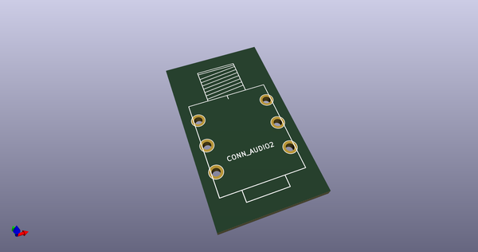
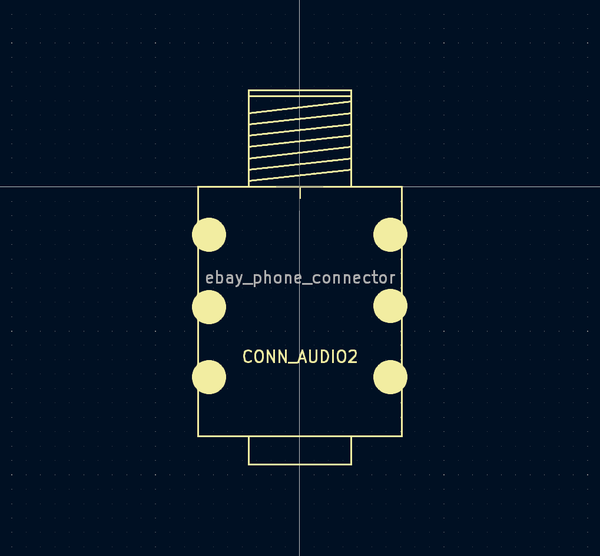

# OOMP Footprint  
## spacestudio_components:ebay_phone_connector  by alchy  
  
oomp key: oomp_alchy_spacestudio_components_ebay_phone_connector  
  
source repo at: [http://github.com/alchy/spacestudio_components.pretty/blob/master/trimmer_alps-rk09k1130ah1.kicad_mod](http://github.com/alchy/spacestudio_components.pretty/blob/master/trimmer_alps-rk09k1130ah1.kicad_mod)  
## Footprint  
  
  
  
  
| name | value | 
| --- | --- | 
| footprint name | spacestudio_components:ebay_phone_connector | 
| footprint description | None | 
| number of pads | 6 | 
| github path | http://github.com/alchy/spacestudio_components.pretty/blob/master/ebay_phone_connector.kicad_mod | 
| oomp key | oomp_alchy_spacestudio_components_ebay_phone_connector | 
| oomp bot github | https://github.com/oomlout/oomlout_oomp_footprint_bot/tree/main/footprints/alchy_spacestudio_components_ebay_phone_connector/working | 
## Images  
