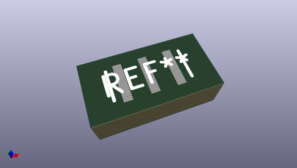

# OOMP Footprint  
## MURATA_CSTCE  by alexisvl  
  
oomp key: oomp_alexisvl_manuf_murata_cstce  
  
source repo at: [http://github.com/cpavlina/kicad-pcblib/blob/master/smd-semi.pretty/VQFN50P230X230X100-12.kicad_mod](http://github.com/cpavlina/kicad-pcblib/blob/master/smd-semi.pretty/VQFN50P230X230X100-12.kicad_mod)  
## Footprint  
  
  
  
  
| name | value | 
| --- | --- | 
| footprint name | MURATA_CSTCE | 
| footprint description | None | 
| number of pads | 3 | 
| github path | http://github.com/cpavlina/kicad-pcblib/blob/master/manuf.pretty/MURATA_CSTCE.kicad_mod | 
| oomp key | oomp_alexisvl_manuf_murata_cstce | 
| oomp bot github | https://github.com/oomlout/oomlout_oomp_footprint_bot/tree/main/footprints/alexisvl_manuf_murata_cstce/working | 
## Images  
