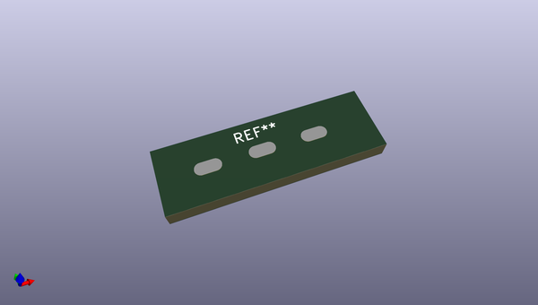

# OOMP Footprint  
## Pad_3_SMD_P5.08_Rev  by alozewski  
  
oomp key: oomp_alozewski_al_kicad_lib_pad_3_smd_p5_08_rev  
  
source repo at: [http://github.com/alozewski/al-kicad-lib.pretty/blob/master/Valve_ECC83_Conn.kicad_mod](http://github.com/alozewski/al-kicad-lib.pretty/blob/master/Valve_ECC83_Conn.kicad_mod)  
## Footprint  
  
  
  
  
| name | value | 
| --- | --- | 
| footprint name | Pad_3_SMD_P5.08_Rev | 
| footprint description | None | 
| number of pads | 3 | 
| github path | http://github.com/alozewski/al-kicad-lib.pretty/blob/master/Pad_3_SMD_P5.08_Rev.kicad_mod | 
| oomp key | oomp_alozewski_al_kicad_lib_pad_3_smd_p5_08_rev | 
| oomp bot github | https://github.com/oomlout/oomlout_oomp_footprint_bot/tree/main/footprints/alozewski_al_kicad_lib_pad_3_smd_p5_08_rev/working | 
## Images  
