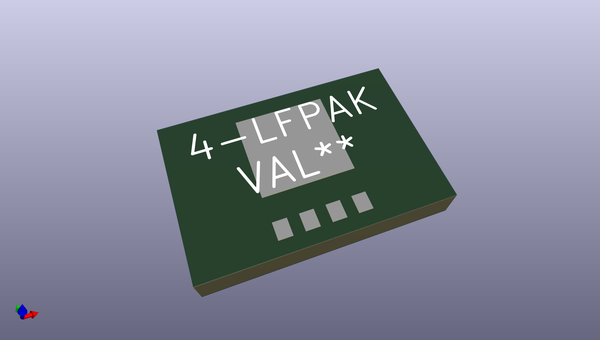
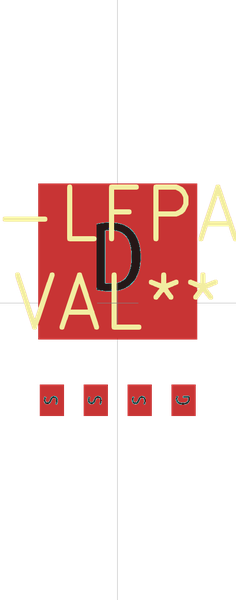

# OOMP Footprint  
## 4-LFPAK  by apexelectrix  
  
oomp key: oomp_apexelectrix_apex_4_lfpak  
  
source repo at: [http://github.com/apexelectrix/Apex.pretty/blob/master/USB-Micro-B.kicad_mod](http://github.com/apexelectrix/Apex.pretty/blob/master/USB-Micro-B.kicad_mod)  
## Footprint  
  
  
  
  
| name | value | 
| --- | --- | 
| footprint name | 4-LFPAK | 
| footprint description | None | 
| number of pads | 5 | 
| github path | http://github.com/apexelectrix/Apex.pretty/blob/master/4-LFPAK.kicad_mod | 
| oomp key | oomp_apexelectrix_apex_4_lfpak | 
| oomp bot github | https://github.com/oomlout/oomlout_oomp_footprint_bot/tree/main/footprints/apexelectrix_apex_4_lfpak/working | 
## Images  
