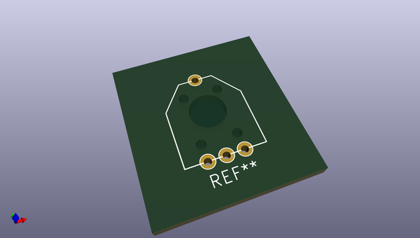
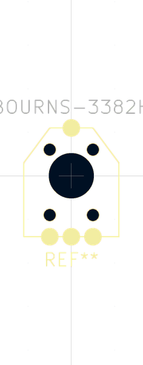

# OOMP Footprint  
## BOURNS-3382H  by ariejan  
  
oomp key: oomp_ariejan_ariejan_bourns_3382h  
  
source repo at: [http://github.com/ariejan/ariejan.pretty/blob/master/TRIMMER-TC33X-2.kicad_mod](http://github.com/ariejan/ariejan.pretty/blob/master/TRIMMER-TC33X-2.kicad_mod)  
## Footprint  
  
  
  
  
| name | value | 
| --- | --- | 
| footprint name | BOURNS-3382H | 
| footprint description | None | 
| number of pads | 9 | 
| github path | http://github.com/ariejan/ariejan.pretty/blob/master/BOURNS-3382H.kicad_mod | 
| oomp key | oomp_ariejan_ariejan_bourns_3382h | 
| oomp bot github | https://github.com/oomlout/oomlout_oomp_footprint_bot/tree/main/footprints/ariejan_ariejan_bourns_3382h/working | 
## Images  
