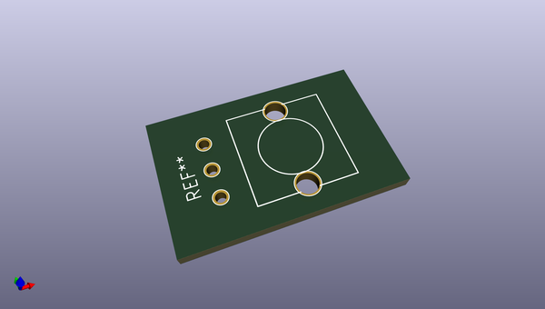

# OOMP Footprint  
##   by ariejan  
  
oomp key: oomp_ariejan_ariejan_pot_cts_296  
  
source repo at: [http://github.com/ariejan/ariejan.pretty/blob/master/TRIMMER-TC33X-2.kicad_mod](http://github.com/ariejan/ariejan.pretty/blob/master/TRIMMER-TC33X-2.kicad_mod)  
## Footprint  
  
  
  
  
| name | value | 
| --- | --- | 
| footprint name |  | 
| footprint description |  | 
| number of pads |  | 
| github path | http://github.com/ariejan/ariejan.pretty/blob/master/POT_CTS_296.kicad_mod | 
| oomp key | oomp_ariejan_ariejan_pot_cts_296 | 
| oomp bot github | https://github.com/oomlout/oomlout_oomp_footprint_bot/tree/main/footprints/ariejan_ariejan_pot_cts_296/working | 
## Images  
