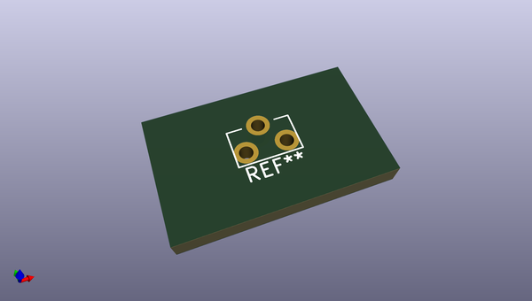

# OOMP Footprint  
## KAN4562-0501C  by arturo182  
  
oomp key: oomp_arturo182_button_switch_tht_extra_kan4562_0501c  
  
source repo at: [http://github.com/arturo182/kicad-modules/blob/master/Symbols_Extra.pretty/SolderParty-New-Logo_7.5x6.4mm_SilkScreen.kicad_mod](http://github.com/arturo182/kicad-modules/blob/master/Symbols_Extra.pretty/SolderParty-New-Logo_7.5x6.4mm_SilkScreen.kicad_mod)  
## Footprint  
  
  
  
  
| name | value | 
| --- | --- | 
| footprint name | KAN4562-0501C | 
| footprint description | None | 
| number of pads | 3 | 
| github path | http://github.com/arturo182/kicad-modules/blob/master/Button_Switch_THT_Extra.pretty/KAN4562-0501C.kicad_mod | 
| oomp key | oomp_arturo182_button_switch_tht_extra_kan4562_0501c | 
| oomp bot github | https://github.com/oomlout/oomlout_oomp_footprint_bot/tree/main/footprints/arturo182_button_switch_tht_extra_kan4562_0501c/working | 
## Images  
