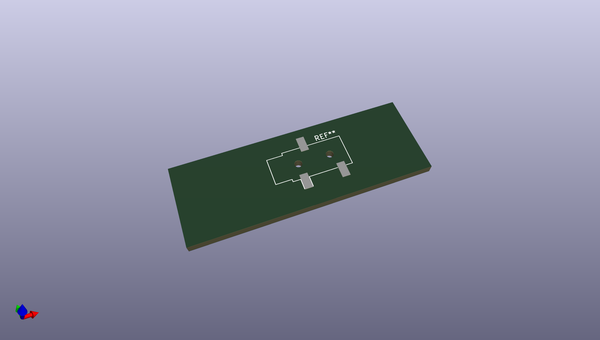
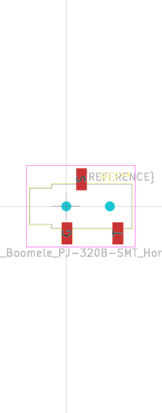

# OOMP Footprint  
## Jack_3.5mm_Boomele_PJ-320B-SMT_Horizontal  by arturo182  
  
oomp key: oomp_arturo182_connector_audio_extra_jack_3_5mm_boomele_pj_320b_smt_horizontal  
  
source repo at: [http://github.com/arturo182/kicad-modules/blob/master/Symbols_Extra.pretty/SolderParty-New-Logo_7.5x6.4mm_SilkScreen.kicad_mod](http://github.com/arturo182/kicad-modules/blob/master/Symbols_Extra.pretty/SolderParty-New-Logo_7.5x6.4mm_SilkScreen.kicad_mod)  
## Footprint  
  
  
  
  
| name | value | 
| --- | --- | 
| footprint name | Jack_3.5mm_Boomele_PJ-320B-SMT_Horizontal | 
| footprint description | None | 
| number of pads | 5 | 
| github path | http://github.com/arturo182/kicad-modules/blob/master/Connector_Audio_Extra.pretty/Jack_3.5mm_Boomele_PJ-320B-SMT_Horizontal.kicad_mod | 
| oomp key | oomp_arturo182_connector_audio_extra_jack_3_5mm_boomele_pj_320b_smt_horizontal | 
| oomp bot github | https://github.com/oomlout/oomlout_oomp_footprint_bot/tree/main/footprints/arturo182_connector_audio_extra_jack_3_5mm_boomele_pj_320b_smt_horizontal/working | 
## Images  
