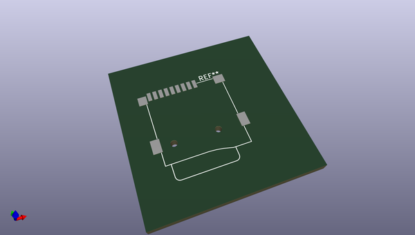
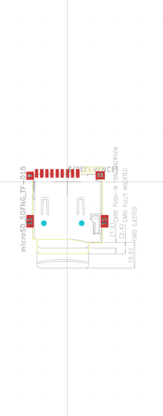

# OOMP Footprint  
## microSD_SOFNG_TF-015  by arturo182  
  
oomp key: oomp_arturo182_connector_card_extra_microsd_sofng_tf_015  
  
source repo at: [http://github.com/arturo182/kicad-modules/blob/master/Symbols_Extra.pretty/SolderParty-New-Logo_7.5x6.4mm_SilkScreen.kicad_mod](http://github.com/arturo182/kicad-modules/blob/master/Symbols_Extra.pretty/SolderParty-New-Logo_7.5x6.4mm_SilkScreen.kicad_mod)  
## Footprint  
  
  
  
  
| name | value | 
| --- | --- | 
| footprint name | microSD_SOFNG_TF-015 | 
| footprint description | None | 
| number of pads | 15 | 
| github path | http://github.com/arturo182/kicad-modules/blob/master/Connector_Card_Extra.pretty/microSD_SOFNG_TF-015.kicad_mod | 
| oomp key | oomp_arturo182_connector_card_extra_microsd_sofng_tf_015 | 
| oomp bot github | https://github.com/oomlout/oomlout_oomp_footprint_bot/tree/main/footprints/arturo182_connector_card_extra_microsd_sofng_tf_015/working | 
## Images  
