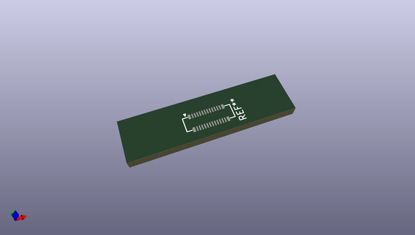
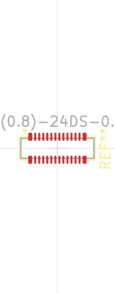

# OOMP Footprint  
## BM14B(0.8)-24DS-0.4V(53)  by arturo182  
  
oomp key: oomp_arturo182_connector_hirose_extra_bm14b(0_8)_24ds_0_4v(53)  
  
source repo at: [http://github.com/arturo182/kicad-modules/blob/master/Symbols_Extra.pretty/SolderParty-New-Logo_7.5x6.4mm_SilkScreen.kicad_mod](http://github.com/arturo182/kicad-modules/blob/master/Symbols_Extra.pretty/SolderParty-New-Logo_7.5x6.4mm_SilkScreen.kicad_mod)  
## Footprint  
  
  
  
  
| name | value | 
| --- | --- | 
| footprint name | BM14B(0.8)-24DS-0.4V(53) | 
| footprint description | None | 
| number of pads | 28 | 
| github path | http://github.com/arturo182/kicad-modules/blob/master/Connector_Hirose_Extra.pretty/BM14B(0.8)-24DS-0.4V(53).kicad_mod | 
| oomp key | oomp_arturo182_connector_hirose_extra_bm14b(0_8)_24ds_0_4v(53) | 
| oomp bot github | https://github.com/oomlout/oomlout_oomp_footprint_bot/tree/main/footprints/arturo182_connector_hirose_extra_bm14b(0_8)_24ds_0_4v(53)/working | 
## Images  
