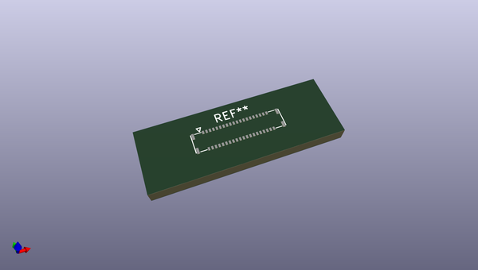
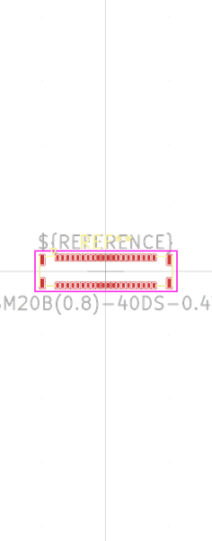

# OOMP Footprint  
## BM20B(0.8)-40DS-0.4V  by arturo182  
  
oomp key: oomp_arturo182_connector_hirose_extra_bm20b(0_8)_40ds_0_4v  
  
source repo at: [http://github.com/arturo182/kicad-modules/blob/master/Symbols_Extra.pretty/SolderParty-New-Logo_7.5x6.4mm_SilkScreen.kicad_mod](http://github.com/arturo182/kicad-modules/blob/master/Symbols_Extra.pretty/SolderParty-New-Logo_7.5x6.4mm_SilkScreen.kicad_mod)  
## Footprint  
  
  
  
  
| name | value | 
| --- | --- | 
| footprint name | BM20B(0.8)-40DS-0.4V | 
| footprint description | None | 
| number of pads | 44 | 
| github path | http://github.com/arturo182/kicad-modules/blob/master/Connector_Hirose_Extra.pretty/BM20B(0.8)-40DS-0.4V.kicad_mod | 
| oomp key | oomp_arturo182_connector_hirose_extra_bm20b(0_8)_40ds_0_4v | 
| oomp bot github | https://github.com/oomlout/oomlout_oomp_footprint_bot/tree/main/footprints/arturo182_connector_hirose_extra_bm20b(0_8)_40ds_0_4v/working | 
## Images  
