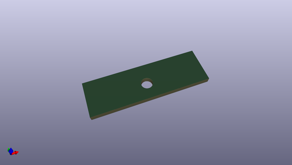

# OOMP Footprint  
## MountingHole_3.2mm_M3_with_paste  by arturo182  
  
oomp key: oomp_arturo182_mountinghole_extra_mountinghole_3_2mm_m3_with_paste  
  
source repo at: [http://github.com/arturo182/kicad-modules/blob/master/Symbols_Extra.pretty/SolderParty-New-Logo_7.5x6.4mm_SilkScreen.kicad_mod](http://github.com/arturo182/kicad-modules/blob/master/Symbols_Extra.pretty/SolderParty-New-Logo_7.5x6.4mm_SilkScreen.kicad_mod)  
## Footprint  
  
  
  
  
| name | value | 
| --- | --- | 
| footprint name | MountingHole_3.2mm_M3_with_paste | 
| footprint description | Mounting Hole 3.2mm, no annular, M3 | 
| number of pads | 1 | 
| github path | http://github.com/arturo182/kicad-modules/blob/master/MountingHole_Extra.pretty/MountingHole_3.2mm_M3_with_paste.kicad_mod | 
| oomp key | oomp_arturo182_mountinghole_extra_mountinghole_3_2mm_m3_with_paste | 
| oomp bot github | https://github.com/oomlout/oomlout_oomp_footprint_bot/tree/main/footprints/arturo182_mountinghole_extra_mountinghole_3_2mm_m3_with_paste/working | 
## Images  
