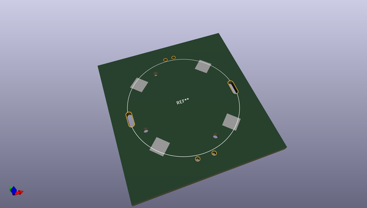
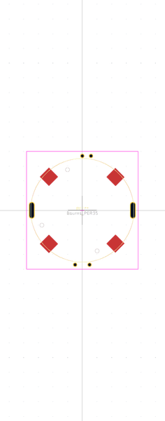

# OOMP Footprint  
##   by arturo182  
  
oomp key: oomp_arturo182_rotary_encoder_extra_bourns_per35  
  
source repo at: [http://github.com/arturo182/kicad-modules/blob/master/Symbols_Extra.pretty/SolderParty-New-Logo_7.5x6.4mm_SilkScreen.kicad_mod](http://github.com/arturo182/kicad-modules/blob/master/Symbols_Extra.pretty/SolderParty-New-Logo_7.5x6.4mm_SilkScreen.kicad_mod)  
## Footprint  
  
  
  
  
| name | value | 
| --- | --- | 
| footprint name |  | 
| footprint description |  | 
| number of pads |  | 
| github path | http://github.com/arturo182/kicad-modules/blob/master/Rotary_Encoder_Extra.pretty/Bourns_PER35.kicad_mod | 
| oomp key | oomp_arturo182_rotary_encoder_extra_bourns_per35 | 
| oomp bot github | https://github.com/oomlout/oomlout_oomp_footprint_bot/tree/main/footprints/arturo182_rotary_encoder_extra_bourns_per35/working | 
## Images  
