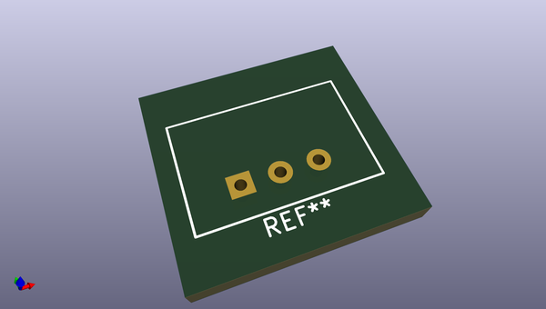
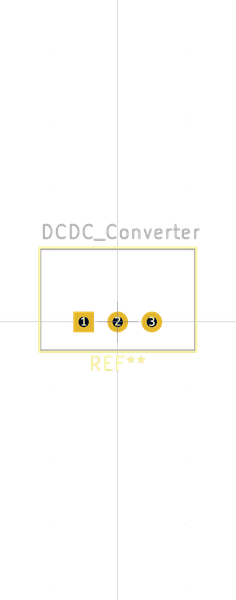

# OOMP Footprint  
## DCDC_Converter  by none  
  
oomp key: oomp_asukiaaa_asukiaaa_kicad_footprints_dcdc_converter  
  
source repo at: [http://gitlab.com/asukiaaa/asukiaaa-kicad-footprints.pretty/blob/master/WQFN48-0707.kicad_mod](http://gitlab.com/asukiaaa/asukiaaa-kicad-footprints.pretty/blob/master/WQFN48-0707.kicad_mod)  
## Footprint  
  
  
  
  
| name | value | 
| --- | --- | 
| footprint name | DCDC_Converter | 
| footprint description | None | 
| number of pads | 3 | 
| github path | http://github.com/asukiaaa/asukiaaa-kicad-footprints.pretty/blob/master/DCDC_Converter.kicad_mod | 
| oomp key | oomp_asukiaaa_asukiaaa_kicad_footprints_dcdc_converter | 
| oomp bot github | https://github.com/oomlout/oomlout_oomp_footprint_bot/tree/main/footprints/asukiaaa_asukiaaa_kicad_footprints_dcdc_converter/working | 
## Images  
