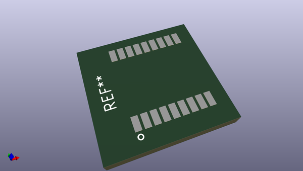
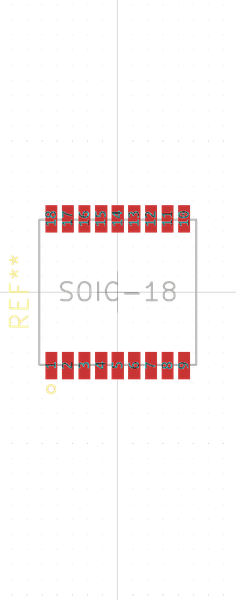

# OOMP Footprint  
## UBLOX-MAX-M8  by none  
  
oomp key: oomp_av_p_avp_ublox_max_m8  
  
source repo at: [http://gitlab.com/av-p/Avp.pretty/blob/master/XTAL-3215.kicad_mod](http://gitlab.com/av-p/Avp.pretty/blob/master/XTAL-3215.kicad_mod)  
## Footprint  
  
  
  
  
| name | value | 
| --- | --- | 
| footprint name | UBLOX-MAX-M8 | 
| footprint description | None | 
| number of pads | 18 | 
| github path | http://github.com/av-p/Avp.pretty/blob/master/UBLOX-MAX-M8.kicad_mod | 
| oomp key | oomp_av_p_avp_ublox_max_m8 | 
| oomp bot github | https://github.com/oomlout/oomlout_oomp_footprint_bot/tree/main/footprints/av_p_avp_ublox_max_m8/working | 
## Images  
