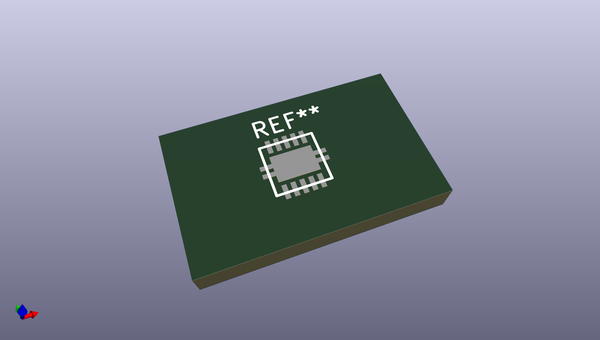

# OOMP Footprint  
## S-PVSON-N10  by none  
  
oomp key: oomp_blackb3ar_kicadprints_s_pvson_n10  
  
source repo at: [http://gitlab.com/blackb3ar/kicadprints.pretty/blob/master/TestPad.kicad_mod](http://gitlab.com/blackb3ar/kicadprints.pretty/blob/master/TestPad.kicad_mod)  
## Footprint  
  
  
  
  
| name | value | 
| --- | --- | 
| footprint name | S-PVSON-N10 | 
| footprint description | None | 
| number of pads | 15 | 
| github path | http://github.com/blackb3ar/kicadprints.pretty/blob/master/S-PVSON-N10.kicad_mod | 
| oomp key | oomp_blackb3ar_kicadprints_s_pvson_n10 | 
| oomp bot github | https://github.com/oomlout/oomlout_oomp_footprint_bot/tree/main/footprints/blackb3ar_kicadprints_s_pvson_n10/working | 
## Images  
