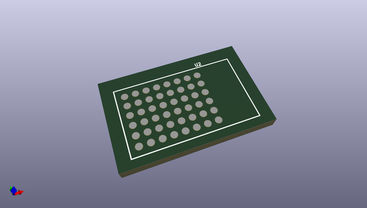
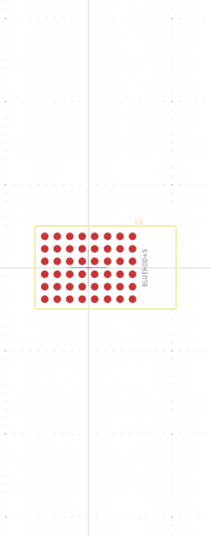

# OOMP Footprint  
## BLUEMOD+S  by none  
  
oomp key: oomp_brunoeagle_bluemod_s_bluemod_s  
  
source repo at: [http://gitlab.com/brunoeagle/kicad-open-modules/blob/master/XH-2AW.kicad_mod](http://gitlab.com/brunoeagle/kicad-open-modules/blob/master/XH-2AW.kicad_mod)  
## Footprint  
  
  
  
  
| name | value | 
| --- | --- | 
| footprint name | BLUEMOD+S | 
| footprint description | None | 
| number of pads | 48 | 
| github path | http://github.com/brunoeagle/kicad-open-modules/blob/master/BLUEMOD+S.kicad_mod | 
| oomp key | oomp_brunoeagle_bluemod_s_bluemod_s | 
| oomp bot github | https://github.com/oomlout/oomlout_oomp_footprint_bot/tree/main/footprints/brunoeagle_bluemod_s_bluemod_s/working | 
## Images  
