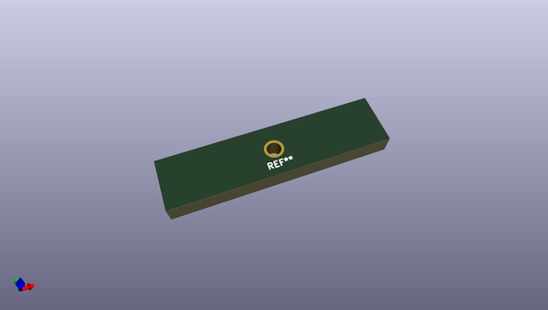

# OOMP Footprint  
## TestPoint_THTPad_D1.6mm_Drill1.15mm  by none  
  
oomp key: oomp_brunoeagle_testpoint_thtpad_d1_6mm_drill1_15mm_testpoint_thtpad_d1_6mm_drill1_15mm  
  
source repo at: [http://gitlab.com/brunoeagle/kicad-open-modules/blob/master/XH-2AW.kicad_mod](http://gitlab.com/brunoeagle/kicad-open-modules/blob/master/XH-2AW.kicad_mod)  
## Footprint  
  
  
  
  
| name | value | 
| --- | --- | 
| footprint name | TestPoint_THTPad_D1.6mm_Drill1.15mm | 
| footprint description | None | 
| number of pads | 1 | 
| github path | http://github.com/brunoeagle/kicad-open-modules/blob/master/TestPoint_THTPad_D1.6mm_Drill1.15mm.kicad_mod | 
| oomp key | oomp_brunoeagle_testpoint_thtpad_d1_6mm_drill1_15mm_testpoint_thtpad_d1_6mm_drill1_15mm | 
| oomp bot github | https://github.com/oomlout/oomlout_oomp_footprint_bot/tree/main/footprints/brunoeagle_testpoint_thtpad_d1_6mm_drill1_15mm_testpoint_thtpad_d1_6mm_drill1_15mm/working | 
## Images  
