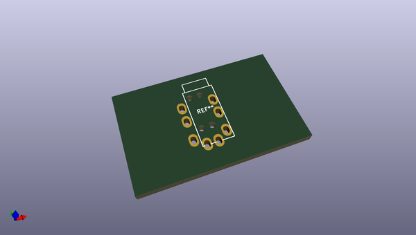

# OOMP Footprint  
## Jack_3.5mm_MJ-4PP-9_Horizontal  by none  
  
oomp key: oomp_bsakatu_kicad_parts_bsakatu_jack_3_5mm_mj_4pp_9_horizontal  
  
source repo at: [http://gitlab.com/bsakatu/kicad_parts_bsakatu.pretty/blob/master/USB_C_HRO-TYPE-C-31-M-14_HandSoldering.kicad_mod](http://gitlab.com/bsakatu/kicad_parts_bsakatu.pretty/blob/master/USB_C_HRO-TYPE-C-31-M-14_HandSoldering.kicad_mod)  
## Footprint  
  
  
  
  
| name | value | 
| --- | --- | 
| footprint name | Jack_3.5mm_MJ-4PP-9_Horizontal | 
| footprint description | Headphones with microphone connector, 3.5mm, 4 pins | 
| number of pads | 12 | 
| github path | http://github.com/bsakatu/kicad_parts_bsakatu.pretty/blob/master/Jack_3.5mm_MJ-4PP-9_Horizontal.kicad_mod | 
| oomp key | oomp_bsakatu_kicad_parts_bsakatu_jack_3_5mm_mj_4pp_9_horizontal | 
| oomp bot github | https://github.com/oomlout/oomlout_oomp_footprint_bot/tree/main/footprints/bsakatu_kicad_parts_bsakatu_jack_3_5mm_mj_4pp_9_horizontal/working | 
## Images  
