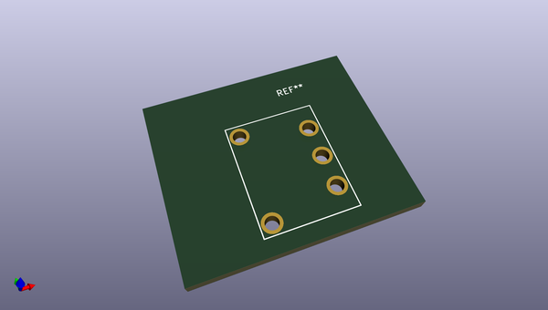
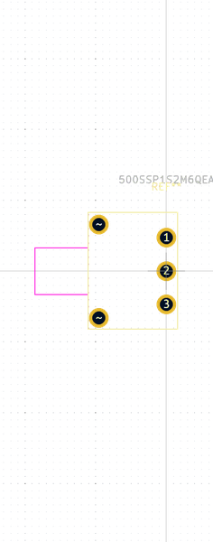

# OOMP Footprint  
## 500SSP1S2M6QEA  by none  
  
oomp key: oomp_candykingdom_homebrew_500ssp1s2m6qea  
  
source repo at: [http://gitlab.com/candykingdom/homebrew.pretty/blob/master/‎EG1206‎_SLIDE_SWITCH.kicad_mod](http://gitlab.com/candykingdom/homebrew.pretty/blob/master/‎EG1206‎_SLIDE_SWITCH.kicad_mod)  
## Footprint  
  
  
  
  
| name | value | 
| --- | --- | 
| footprint name | 500SSP1S2M6QEA | 
| footprint description | SWITCH SLIDE SPDT 5A 120V | 
| number of pads | 5 | 
| github path | http://github.com/candykingdom/homebrew.pretty/blob/master/500SSP1S2M6QEA.kicad_mod | 
| oomp key | oomp_candykingdom_homebrew_500ssp1s2m6qea | 
| oomp bot github | https://github.com/oomlout/oomlout_oomp_footprint_bot/tree/main/footprints/candykingdom_homebrew_500ssp1s2m6qea/working | 
## Images  
