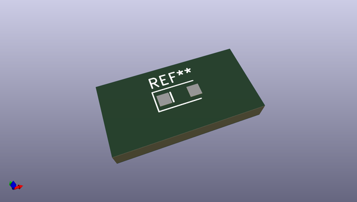
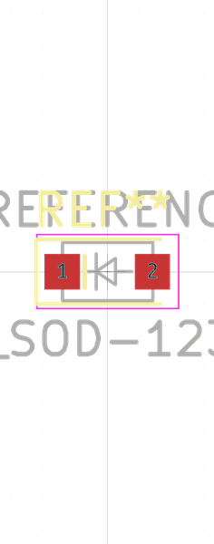

# OOMP Footprint  
## D_SOD-123F  by none  
  
oomp key: oomp_candykingdom_homebrew_d_sod_123f  
  
source repo at: [http://gitlab.com/candykingdom/homebrew.pretty/blob/master/‎EG1206‎_SLIDE_SWITCH.kicad_mod](http://gitlab.com/candykingdom/homebrew.pretty/blob/master/‎EG1206‎_SLIDE_SWITCH.kicad_mod)  
## Footprint  
  
  
  
  
| name | value | 
| --- | --- | 
| footprint name | D_SOD-123F | 
| footprint description | D_SOD-123F | 
| number of pads | 2 | 
| github path | http://github.com/candykingdom/homebrew.pretty/blob/master/D_SOD-123F.kicad_mod | 
| oomp key | oomp_candykingdom_homebrew_d_sod_123f | 
| oomp bot github | https://github.com/oomlout/oomlout_oomp_footprint_bot/tree/main/footprints/candykingdom_homebrew_d_sod_123f/working | 
## Images  
